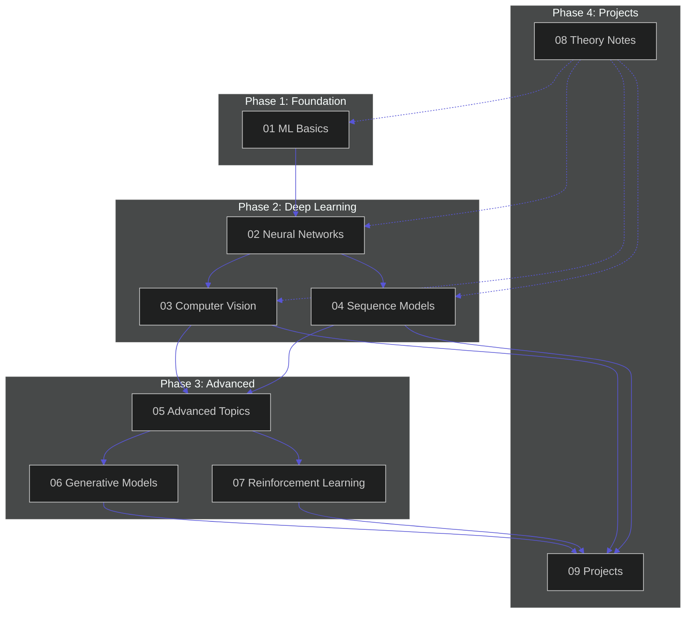

<div align="center">

<!-- iOS风格动态标题 -->
<a href="https://github.com/zimingttkx/AI-Practices">
  
</a>

<a href="https://github.com/zimingttkx/AI-Practices">
  
</a>

<br/><br/>

<!-- iOS风格核心统计卡片 -->
<a href="https://github.com/zimingttkx/AI-Practices/stargazers">
  
</a>
&nbsp;
<a href="https://github.com/zimingttkx/AI-Practices/network/members">
  
</a>
&nbsp;
<a href="https://github.com/zimingttkx/AI-Practices/issues">
  
</a>
&nbsp;
<a href="./LICENSE">
  
</a>

<br/><br/>

<!-- 活跃度指标 -->
<a href="https://github.com/zimingttkx/AI-Practices/commits/main">
  
</a>
&nbsp;
<a href="https://github.com/zimingttkx/AI-Practices/graphs/commit-activity">
  
</a>
&nbsp;
<a href="https://github.com/zimingttkx/AI-Practices">
  
</a>
&nbsp;


<br/><br/>

<!-- 快捷导航 -->
<a href="./README_EN.md">
  
</a>
&nbsp;
<a href="https://zimingttkx.github.io/AI-Practices/">
  
</a>

</div>

<br/>

<!-- 动态分隔线 -->


<br/>

## Overview

**AI-Practices** 是一个系统化的人工智能学习与研究平台，采用**渐进式学习框架**构建从经典机器学习到前沿深度学习的完整知识体系。

<div align="center">

| Metric | Value | Description |
|:------:|:-----:|:------------|
| **Notebooks** | `113+` | 可复现实验，含详细注释 |
| **Modules** | `9` | 核心学习模块 |
| **Projects** | `19` | 端到端实战项目 |
| **Code** | `149k+` | 行高质量代码 (PEP8) |
| **Kaggle** | `Gold` | 竞赛金牌方案 |

</div>

<br/>

## Tech Stack

<div align="center">

<!-- 深度学习框架 -->

&nbsp;

&nbsp;

&nbsp;


<br/><br/>

<!-- 数据科学 -->

&nbsp;

&nbsp;

&nbsp;

&nbsp;


</div>

<br/>

<!-- 动态分隔线 -->


<br/>

## Curriculum

<div align="center">



</div>

<br/>

### Module Details

| # | Module | Topics | Level |
|:-:|:-------|:-------|:-----:|
| **01** | **Foundations** | Linear Models, SVM, Trees, Ensemble, Clustering | Foundation |
| **02** | **Neural Networks** | Keras, Training Techniques, Custom Models | Core |
| **03** | **Computer Vision** | CNN Architectures, Transfer Learning, Interpretability | Core |
| **04** | **Sequence Models** | RNN/LSTM/GRU, Attention, Transformers, BERT | Core |
| **05** | **Advanced Topics** | Hyperparameter Tuning, Distributed Training, Deployment | Advanced |
| **06** | **Generative Models** | VAE, GAN, Diffusion Models | Advanced |
| **07** | **Reinforcement Learning** | DQN, Policy Gradient, PPO, SAC | Advanced |
| **08** | **Theory Notes** | Mathematical Foundations, Optimization | Reference |
| **09** | **Projects** | Kaggle Competitions, Industry Applications | Practice |

<br/>

<!-- 动态分隔线 -->


<br/>

## Architecture

```
AI-Practices/
│
├── 01-foundations/              # ML Basics: SGD, SVM, Trees, Ensemble
├── 02-neural-networks/          # DL Core: Keras, BatchNorm, Dropout
├── 03-computer-vision/          # CV: LeNet → ResNet → ViT
├── 04-sequence-models/          # NLP: RNN → Transformer → BERT
├── 05-advanced-topics/          # Engineering: Optuna, TensorRT
├── 06-generative-models/        # Generative: VAE, GAN, Diffusion
├── 07-reinforcement-learning/   # RL: DQN, PPO, SAC
├── 08-theory-notes/             # Theory: Math, Optimization
├── 09-practical-projects/       # Projects: Kaggle, Industry
│
└── utils/                       # Tools: Data, Visualization, Metrics
```

<br/>

<!-- 动态分隔线 -->


<br/>

## Results

### Kaggle Competitions

<div align="center">

| Competition | Rank | Medal | Year |
|:------------|:----:|:-----:|:----:|
| Feedback Prize - ELL | **Top 1%** | 🥇 | 2023 |
| RSNA Abdominal Trauma | **Top 1%** | 🥇 | 2023 |
| American Express Default | Top 5% | 🥈 | 2022 |
| RSNA Lumbar Spine | Top 10% | 🥉 | 2024 |

</div>

### Model Benchmarks

<div align="center">

| Model | Dataset | Accuracy | Params |
|:------|:--------|:--------:|:------:|
| ResNet-50 | ImageNet | 76.1% | 25.6M |
| EfficientNet-B0 | ImageNet | 77.1% | 5.3M |
| ViT-B/16 | ImageNet | 77.9% | 86M |
| BERT-base | SST-2 | 93.2% | 110M |

</div>

<br/>

<!-- 动态分隔线 -->


<br/>

## Quick Start

```bash
# Clone
git clone https://github.com/zimingttkx/AI-Practices.git
cd AI-Practices

# Environment
conda create -n ai-practices python=3.10 -y
conda activate ai-practices

# Install
pip install -r requirements.txt

# Launch
jupyter lab
```

### Requirements

| Component | Minimum | Recommended |
|:----------|:--------|:------------|
| CPU | 4 cores | 8+ cores |
| RAM | 8 GB | 32 GB |
| GPU | GTX 1060 | RTX 3080+ |
| Storage | 50 GB | 200 GB SSD |

<br/>

<!-- 动态分隔线 -->


<br/>

## Citation

```bibtex
@misc{ai-practices2024,
  author       = {zimingttkx},
  title        = {AI-Practices: A Systematic Approach to AI Research and Engineering},
  year         = {2024},
  publisher    = {GitHub},
  howpublished = {\url{https://github.com/zimingttkx/AI-Practices}}
}
```

<br/>

## License

This project is licensed under the **MIT License** - see [LICENSE](LICENSE) for details.

<br/>

<!-- 动态分隔线 -->


<br/>

<div align="center">

<a href="https://github.com/zimingttkx/AI-Practices">
  
</a>

<br/><br/>

**[⬆ Back to Top](#overview)**

</div>
