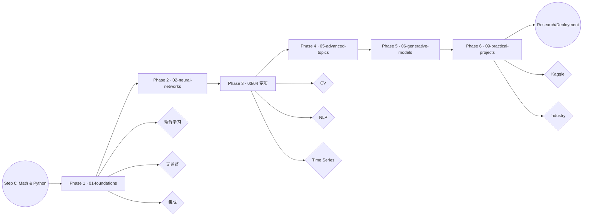
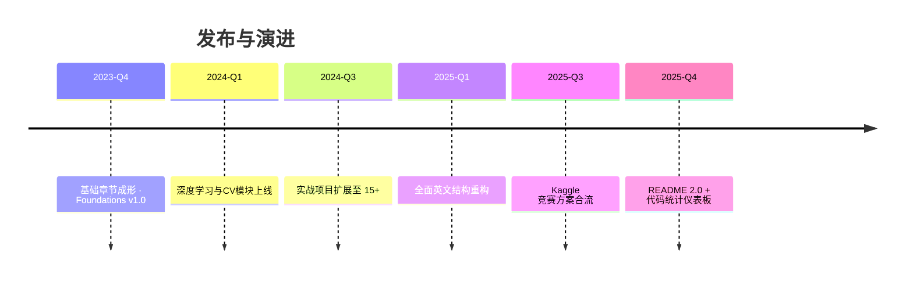

# AI-Practices · 机器学习与深度学习研究路线图

<div align="center">


</div>

<div align="center">

[](#-代码脉搏-code-pulse)
[](#-代码脉搏-code-pulse)
[](#-代码脉搏-code-pulse)
[](#-代码脉搏-code-pulse)

</div>

> **AI-Practices** 是我为自己科研与教学所搭建的全栈式学习体系：覆盖机器学习、深度学习、计算机视觉、NLP、时间序列、推荐系统与生成式 AI，既可做系统课程，也能作为研究备忘录。

[快速导航](#快速导航) · [学习地图](#学习地图) · [模块概览](#模块概览) · [实战项目](#实战项目) · [环境配置](#环境配置) · [质量保障](#质量保障) · [致谢](#致谢)

---

## 快速导航

| 📂 顶层目录 | 说明 | 推荐切入 |
|-------------|------|----------|
| `01-foundations/` | 经典机器学习八大模块 | 回归/分类/集成学习/无监督 |
| `02-neural-networks/` | Keras & TensorFlow 深度学习基础 | 从零搭建 NN、训练技巧 |
| `03-computer-vision/` | CNN、目标检测、分割、可视化 | 图像方向研究/竞赛 |
| `04-sequence-models/` | RNN、LSTM、Transformer | NLP 与时间序列 |
| `05-advanced-topics/` | Functional API、回调、调参 | 工程化/优化 |
| `06-generative-models/` | AutoEncoder、GAN、VAE、文本生成 | 生成式 AI 与艺术创作 |
| `08-theory-notes/` | 激活函数、损失函数、架构理论 | 快速查阅公式与最佳实践 |
| `09-practical-projects/` | 端到端 Kaggle/科研项目 19+ | 直接复现/迁移 |
| `docs/` | 指南、审计报告、质量手册 | 了解策略与制度 | 
| `激活函数与损失函数/` | 中文图谱 + Notebook | 快速演示与课堂使用 |

---

## 研究概况

| 指标 | 数量 | 说明 |
|------|------|------|
| 📒 Jupyter Notebooks | **113+** | 完整可运行的实验记录 |
| 📘 Markdown 文档 | **30+** | 体系化理论与操作手册 |
| 🧠 主要板块 | **8** | Foundations → Generative |
| 🚀 实战项目 | **19** | 真实数据 + 训练脚本 + 可视化 |
| 🧾 质量报告 | **4** | `CONTENT_AUDIT_*`, `NOTEBOOK_QUALITY_REPORT` 等 |

> 📌 **Maintainer's note**：所有内容均由我亲自整理、测试与审阅，不依赖任何自动化脚本；每次大规模变更都会同步在 `migration_log.json` 与质量报告中留档。

---

## 📊 代码脉搏 (Code Pulse)

| 语言/介质 | 行数 | 占比 | 典型用途 |
|-----------|------|------|----------|
| Python (`.py`) | **64,692** | **43%** | 训练脚本、工具模块、推理代码 |
| Jupyter (`.ipynb`) | **46,787** | **31%** | 可复现实验与课堂 Demo |
| Markdown (`.md`) | **25,749** | **17%** | 理论笔记、实验记录、质量报告 |
| YAML (`.yml / .yaml`) | **12,673** | **9%** | 环境配置、Kaggle workflow、CI blueprint |

```text
Python      ██████████████████ 43%
Notebooks   ████████████       31%
Markdown    ██████             17%
YAML        ███                09%
```

> 统计时间：2025-11，基于仓库全量扫描（排除 `.git`/临时缓存）。随着新项目合入将持续刷新。

---

## 学习地图



- **阶段化目标**：每一阶段都附有 README、notes、notebooks；全部采用 Why → What → When → How → Watch Out 的写作模板。
- **任务追踪**：`SESSION_COMPLETION_REPORT.md`、`NOTEBOOK_OPTIMIZATION_GUIDE.md` 记录每周推进与修复策略。

---

## 模块概览

<details>
<summary><strong>01 · Foundations（8 章）</strong></summary>

- 线性/逻辑回归、正则化、梯度下降
- 决策树、随机森林、XGBoost、SVM、降维、聚类
- 每章包含：`notes/` 理论 + `notebooks/` 实验 + `projects/` 小型案例
</details>

<details>
<summary><strong>02 · Neural Networks（4 章）</strong></summary>

- Sequential/Functional API、回调、TensorBoard、tf.data
- 手写自定义 Layer/Loss/Training Loop
- 提供 `utils/common.py`、`utils/visualization.py` 等快速复用模块
</details>

<details>
<summary><strong>03 · Computer Vision（5 章）</strong></summary>

- CNN 基础、经典架构（LeNet, AlexNet, VGG, ResNet, Inception）
- 迁移学习、目标检测、语义分割、可视化（Grad-CAM、Filter Visualization）
</details>

<details>
<summary><strong>04 · Sequence Models（5 章）</strong></summary>

- RNN/LSTM/GRU、Attention、seq2seq、Transformer、文本预处理与嵌入
- 包含中文 IMDB 数据、词嵌入、语言模型案例
</details>

<details>
<summary><strong>05 · Advanced Topics（5 章）</strong></summary>

- Functional API 高级用法、多输入多输出 DAG
- 回调、TensorBoard 监控、超参调优、部署思路
</details>

<details>
<summary><strong>06 · Generative Models（5 章）</strong></summary>

- AutoEncoder, Variational AutoEncoder, GAN, DCGAN, Style Transfer, 文本生成
- 配套 `激活函数与损失函数/` 中的可视化笔记
</details>

<details>
<summary><strong>08 · Theory Notes</strong></summary>

- `activation-functions/` & `loss-functions/`：30+ 激活函数 & 全栈损失函数图谱
- `architectures/`：网络拓扑、优化器、正则化对照表
</details>

<details>
<summary><strong>09 · Practical Projects（19 套）</strong></summary>

- 机器学习 4 项、计算机视觉 4 项、NLP 4 项、时间序列 3 项、推荐 1 项、生成式 AI 3 项
- 每套均自带 `src/` 模块化代码、`data/` 下载脚本、`train.py`、`evaluate.py`
</details>

---

## 实战项目

| 类别 | 代表项目 | 技术栈 | 亮点 |
|------|----------|--------|------|
| 机器学习基础 | Titanic 生存预测、Otto 分类 | Scikit-learn, XGBoost | 全流程特征工程 + 模型对比 |
| 计算机视觉 | MNIST、猫狗分类、RSNA 系列 | TensorFlow, Keras, Albumentations | 从入门到 Kaggle 金牌方案拆解 |
| NLP | 情感分析、Transformer 文本分类、NER | LSTM, Transformer, HuggingFace | 多语言语料 + 注意力机制 |
| 时间序列 | 温度/股票预测 | LSTM, Prophet | 滑动窗口、技术指标、可扩展评估 |
| 推荐系统 | MovieLens NCF | Matrix Factorization, NeuMF | 多策略融合、冷启动处理 |
| 生成式 AI | DCGAN, Text Generation, Style Transfer | GAN, VAE, Attention | 潜空间插值、推理脚本 |

> 所有项目集中在 `09-practical-projects/`，并保持与 `requirements.txt`、`environment.yml` 同步。

---

## 研究工具箱

- 📄 `CONTENT_AUDIT_COMPLETION_REPORT.md`：记录结构重构、笔记补全、质量得分。
- 📄 `CONTENT_AUDIT_PLAN.md`：未来章节规划与任务优先级。
- 📄 `NOTEBOOK_QUALITY_REPORT.md`：运行性、可重复性、注释、资源使用等指标。
- 📄 `NOTEBOOK_OPTIMIZATION_GUIDE.md`：针对 TensorFlow 2.x/Torch 2.x 的 API 更新手册。
- 📄 `OPTIMIZATION_REPORT.md` & `项目结构优化报告.md`：记录每次大规模调整的目标与结果。

配合 `utils/` 模块即可快速进行：

```python
from utils.common import set_seed, Timer
from utils.visualization import plot_training_history

set_seed(1024)
with Timer("Training"):
    history = model.fit(train_ds, validation_data=val_ds, epochs=20)
plot_training_history(history.history)
```

---

## 📅 更新节奏



> 未来规划：补全 `optimizers/`、`classic-architectures/`、2024-2025 最新 Kaggle 方案，并加入部署/Serving 实践。

---

## 环境配置

```bash
# 1. 创建虚拟环境
conda create -n ai-practices python=3.10 -y
conda activate ai-practices

# 2. 安装核心依赖
pip install -r requirements.txt

# 3. 可选：安装 GPU / 竞赛依赖
python -m pip install -U torch torchvision torchaudio --index-url https://download.pytorch.org/whl/cu121
pip install tensorflow==2.13.1
pip install -r 09-practical-projects/requirements.txt        # 如需 Kaggle/竞赛项目
```

```bash
# 4. 运行示例 Notebook（以 MNIST 项目为例）
cd 09-practical-projects/02_计算机视觉项目/01_MNIST手写数字识别_CNN入门
python src/train.py --model improved_cnn --epochs 20
python src/evaluate.py --checkpoint runs/improved_cnn.best.pt
```

---

## 质量保障

- ✅ `NOTEBOOK_QUALITY_REPORT.md`：逐条列出运行状态 / 依赖 / 结果截图
- ✅ `SESSION_COMPLETION_REPORT.md`：追踪每次学习/调试的完成情况
- ✅ `CONTENT_AUDIT_*`：保证目录、命名、缺失笔记及时补齐
- ✅ `migration_log.json`：映射每一个从中文到英文路径的历史，以便追溯

### 研发待办（节选）
- [ ] `08-theory-notes/optimizers/` 完成剩余笔记
- [ ] `03-computer-vision/02-classic-architectures/` 对比表格 + 训练日志
- [ ] `04-sequence-models/05-sequence-to-sequence/` 增补 Transformer 推理脚本
- [ ] `09-practical-projects/05_Kaggle竞赛项目/` 新增 2024 赛题复盘

---

## 贡献方式

目前项目以科研自用为主，如需讨论或协同：
1. 提交 Issue 描述需求或漏洞（推荐附 notebooks 运行信息）。
2. Fork → 提交 PR，遵循 `CODE_STYLE.md` 与 `CONTRIBUTING.md`。
3. 所有 PR 均需附最小可复现示例或实验截图。

---

## 致谢

- **PyTorch / TensorFlow / Keras / JAX**：本项目中的所有深度学习实验依赖这些优秀的开源框架。
- **Scikit-learn / XGBoost / LightGBM / CatBoost**：提供稳定的经典机器学习基线。
- **Hugging Face Transformers**：使 NLP 模型的复现更加简单高效。
- **Kaggle 社区**：项目中的多个实践案例改编自我在竞赛中的真实代码与经验。
- **Matplotlib / Seaborn / Plotly**：用于可视化的主力工具。

> 感谢所有开源社区的贡献者。若你在使用本仓库时完成了科研或竞赛成果，欢迎在 Issue 中分享。

---

**AI-Practices** · Maintained with ❤️ & curiosity.
