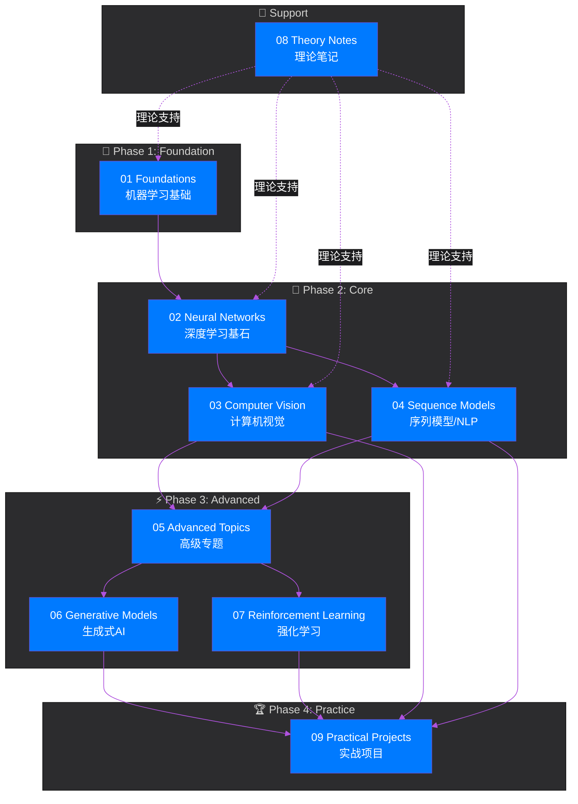

<div align="center">

<!-- 动态渐变头图 - iOS风格 -->


<br/>

<!-- 多行动态打字效果 -->
<a href="https://github.com/zimingttkx/AI-Practices">
  
</a>

<br/>

<a href="https://github.com/zimingttkx/AI-Practices">
  
</a>

<br/><br/>

<!-- iOS风格导航按钮 -->
<a href="./README_EN.md">
  
</a>
&nbsp;
<a href="https://zimingttkx.github.io/AI-Practices/">
  
</a>
&nbsp;
<a href="#-quick-start">
  
</a>

<br/><br/>

<!-- 核心统计徽章 - iOS配色 -->
<a href="https://github.com/zimingttkx/AI-Practices/stargazers">
  
</a>
&nbsp;
<a href="https://github.com/zimingttkx/AI-Practices/network/members">
  
</a>
&nbsp;
<a href="https://github.com/zimingttkx/AI-Practices/issues">
  
</a>
&nbsp;
<a href="./LICENSE">
  
</a>

<br/><br/>

<!-- 活跃度指标 -->
<a href="https://github.com/zimingttkx/AI-Practices/commits/main">
  
</a>
&nbsp;
<a href="https://github.com/zimingttkx/AI-Practices/graphs/commit-activity">
  
</a>
&nbsp;
<a href="https://github.com/zimingttkx/AI-Practices">
  
</a>
&nbsp;


<br/><br/>

<!-- 动态GitHub统计 -->

&nbsp;


</div>

<!-- 动态分隔线 -->


<br/>

## 📋 Table of Contents

<details open>
<summary><b>Quick Navigation</b></summary>
<br/>

| Section | Description | Link |
|:-------:|:------------|:----:|
| 🎯 | **Overview** - 项目概述与研究背景 | [Jump](#-overview) |
| 🏗️ | **Architecture** - 系统架构与模块设计 | [Jump](#️-architecture) |
| 📚 | **Curriculum** - 九大核心学习模块 | [Jump](#-curriculum) |
| 🛠️ | **Tech Stack** - 技术栈与工具链 | [Jump](#️-tech-stack) |
| 🚀 | **Quick Start** - 环境配置与快速启动 | [Jump](#-quick-start) |
| 📊 | **Results** - 实验结果与竞赛成绩 | [Jump](#-results) |
| 📄 | **Citation** - 引用本项目 | [Jump](#-citation) |

</details>

<br/>

<!-- 动态分隔线 -->


<br/>

## 🎯 Overview

<div align="center">

<!-- 项目核心指标卡片 -->
<table>
<tr>
<td align="center">
<br/>
<sub>可复现实验</sub>
</td>
<td align="center">
<br/>
<sub>核心模块</sub>
</td>
<td align="center">
<br/>
<sub>实战项目</sub>
</td>
<td align="center">
<br/>
<sub>代码行数</sub>
</td>
<td align="center">
<br/>
<sub>竞赛金牌</sub>
</td>
</tr>
</table>

</div>

<br/>

### Research Background

> **AI-Practices** 是一个系统化、工程化的人工智能学习与研究平台，采用 **渐进式学习框架 (Progressive Learning Framework)** 方法论，为研究人员、工程师和学习者提供完整的 AI 技术栈学习路径。

<br/>

### Methodology

本项目遵循 **"理论驱动、实践为本、工程导向"** 的设计理念：

<div align="center">

```
┌─────────────────────────────────────────────────────────────────────────┐
│                    Progressive Learning Framework                        │
├─────────────────────────────────────────────────────────────────────────┤
│                                                                          │
│   ┌──────────┐    ┌──────────┐    ┌──────────┐    ┌──────────┐         │
│   │  Theory  │───▶│  Impl    │───▶│Framework │───▶│ Practice │         │
│   │  First   │    │  From    │    │  Master  │    │ Project  │         │
│   │          │    │ Scratch  │    │          │    │          │         │
│   └──────────┘    └──────────┘    └──────────┘    └──────────┘         │
│        │               │               │               │                │
│        ▼               ▼               ▼               ▼                │
│   数学原理        核心算法       TensorFlow       Kaggle竞赛           │
│   算法理论        底层实现       PyTorch          真实项目             │
│                                                                          │
└─────────────────────────────────────────────────────────────────────────┘
```

</div>

<br/>

| Phase | Principle | Method | Output |
|:-----:|:----------|:-------|:-------|
| **Ⅰ** | Theory First | 数学推导 + 算法分析 | 理论笔记 |
| **Ⅱ** | Implementation | NumPy 从零实现 | 核心代码 |
| **Ⅲ** | Framework | TensorFlow/PyTorch | 工程代码 |
| **Ⅳ** | Practice | 真实项目 + 竞赛 | 完整方案 |

<br/>

<!-- 动态分隔线 -->


<br/>

## 🏗️ Architecture

### Module Dependencies

<div align="center">



</div>

<br/>

### Directory Structure

```
AI-Practices/
│
├── 📚 01-foundations/                 # 机器学习基础
│   ├── training-models/               #   优化方法: SGD, Adam, L-BFGS
│   ├── classification/                #   分类算法: LR, SVM, Decision Tree
│   ├── ensemble-learning/             #   集成方法: Bagging, Boosting, Stacking
│   └── unsupervised-learning/         #   无监督: Clustering, Dimensionality Reduction
│
├── 🧠 02-neural-networks/             # 神经网络与深度学习
│   ├── keras-introduction/            #   框架入门: Sequential, Functional API
│   ├── training-deep-networks/        #   训练技巧: BatchNorm, Dropout, Residual
│   └── custom-models/                 #   自定义: Layer, Loss, Training Loop
│
├── 👁️ 03-computer-vision/             # 计算机视觉
│   ├── cnn-architectures/             #   架构演进: LeNet → ResNet → EfficientNet → ViT
│   ├── transfer-learning/             #   迁移学习: Feature Extraction, Fine-tuning
│   └── model-interpretability/        #   可解释性: Grad-CAM, SHAP
│
├── 📝 04-sequence-models/             # 序列模型与NLP
│   ├── rnn-lstm-gru/                  #   循环网络: Vanishing Gradient, Gating
│   ├── attention-transformer/         #   注意力机制: Self-Attention, Multi-Head
│   └── pretrained-models/             #   预训练: BERT, GPT, T5
│
├── ⚡ 05-advanced-topics/             # 高级专题
│   ├── hyperparameter-tuning/         #   超参优化: Optuna, Ray Tune
│   ├── distributed-training/          #   分布式: Data Parallel, Model Parallel
│   └── model-deployment/              #   部署: TensorRT, ONNX, TFLite
│
├── 🎨 06-generative-models/           # 生成式模型
│   ├── variational-autoencoders/      #   VAE: Latent Space, Reparameterization
│   ├── generative-adversarial/        #   GAN: DCGAN, WGAN, StyleGAN
│   └── diffusion-models/              #   扩散: DDPM, Stable Diffusion
│
├── 🎮 07-reinforcement-learning/      # 强化学习
│   ├── value-based/                   #   值方法: Q-Learning, DQN, Double DQN
│   ├── policy-based/                  #   策略方法: REINFORCE, PPO, SAC
│   └── model-based/                   #   模型方法: World Models, MuZero
│
├── 📖 08-theory-notes/                # 理论参考手册
│   ├── mathematical-foundations/      #   数学基础: Linear Algebra, Probability
│   ├── optimization-theory/           #   优化理论: Convex, Non-convex
│   └── information-theory/            #   信息论: Entropy, KL-Divergence
│
├── 🏆 09-practical-projects/          # 实战项目
│   ├── kaggle-competitions/           #   竞赛方案: Gold Medal Solutions
│   └── industry-applications/         #   工业应用: End-to-End Pipelines
│
└── 🔧 utils/                          # 工具库
    ├── data/                          #   数据处理
    ├── visualization/                 #   可视化
    └── metrics/                       #   评估指标
```

<br/>

<!-- 动态分隔线 -->


<br/>

## 📚 Curriculum

<details open>
<summary><b>📘 01 - Foundations | 机器学习基础</b></summary>
<br/>

> 建立坚实的机器学习理论基础，掌握经典算法的原理与实现

| Topic | Algorithm | Complexity | Key Concepts |
|:------|:----------|:-----------|:-------------|
| Linear Models | OLS, Ridge, Lasso | O(nd²) | Regularization, Bias-Variance |
| Classification | Logistic, SVM | O(n²) ~ O(n³) | Maximum Margin, Kernel Trick |
| Tree Methods | CART, RF, GBDT | O(n log n) | Information Gain, Ensemble |
| Dimensionality | PCA, t-SNE, UMAP | O(n²) ~ O(n³) | Manifold Learning |

**Tech**:   

</details>

<details>
<summary><b>🧠 02 - Neural Networks | 神经网络</b></summary>
<br/>

> 掌握深度学习核心技术与训练方法

| Topic | Techniques | Description |
|:------|:-----------|:------------|
| Initialization | Xavier, He, Orthogonal | 权重初始化策略 |
| Normalization | BatchNorm, LayerNorm, GroupNorm | 归一化技术 |
| Regularization | Dropout, DropConnect, Stochastic Depth | 正则化方法 |
| Optimization | SGD+Momentum, Adam, AdamW, LAMB | 优化算法 |

**Tech**:  

</details>

<details>
<summary><b>👁️ 03 - Computer Vision | 计算机视觉</b></summary>
<br/>

> 系统学习 CNN 架构演进与视觉任务

**架构演进**:
```
LeNet (1998) → AlexNet (2012) → VGG (2014) → GoogLeNet (2014)
                                    ↓
ResNet (2015) → DenseNet (2016) → EfficientNet (2019) → ViT (2020)
```

**Tech**:  

</details>

<details>
<summary><b>📝 04 - Sequence Models | 序列模型</b></summary>
<br/>

> 掌握序列建模从 RNN 到 Transformer

**Attention Mechanism**:

$$\text{Attention}(Q, K, V) = \text{softmax}\left(\frac{QK^T}{\sqrt{d_k}}\right)V$$

**Tech**:  

</details>

<details>
<summary><b>⚡ 05~07 - Advanced Modules | 进阶模块</b></summary>
<br/>

| Module | Focus | Key Methods |
|:-------|:------|:------------|
| **05 Advanced** | 工程优化 | Mixed Precision, Gradient Checkpointing, Optuna |
| **06 Generative** | 生成模型 | VAE, GAN (DCGAN/WGAN/StyleGAN), Diffusion |
| **07 RL** | 强化学习 | DQN, A2C, PPO, SAC, World Models |

</details>

<details>
<summary><b>🏆 09 - Practical Projects | 实战项目</b></summary>
<br/>

```
09-practical-projects/
├── 📊 01-ml-basics/                    # ML基础项目
│   ├── titanic-survival-xgboost/       #   Titanic 生存预测
│   └── otto-classification/            #   Otto 产品多分类
│
├── 👁️ 02-computer-vision/              # CV项目
│   └── mnist-cnn/                      #   MNIST 手写数字识别
│
├── 📝 03-nlp/                          # NLP项目
│   ├── sentiment-analysis-lstm/        #   LSTM 情感分析
│   ├── transformer-text-classification/#   Transformer 文本分类
│   └── transformer-ner/                #   命名实体识别
│
├── 📈 04-time-series/                  # 时序项目
│   └── temperature-prediction-lstm/    #   温度预测
│
└── 🏆 05-kaggle-competitions/          # Kaggle 竞赛
    ├── Feedback-ELL-1st-Place/         #   🥇 金牌方案
    └── RSNA-2023-1st-Place/            #   🥇 金牌方案
```

</details>

<br/>

<!-- 动态分隔线 -->


<br/>

## 🛠️ Tech Stack

<div align="center">

<!-- Skill Icons 动态展示 -->
<a href="https://skillicons.dev">
  
</a>

<br/><br/>

<!-- 版本徽章矩阵 -->
<table>
<tr>
<th align="center">🤖 Deep Learning</th>
<th align="center">📊 Data Science</th>
<th align="center">🔧 Development</th>
</tr>
<tr>
<td align="center">


</td>
<td align="center">


</td>
<td align="center">


</td>
</tr>
</table>

</div>

<br/>

<!-- 动态分隔线 -->


<br/>

## 🚀 Quick Start

### Installation

```bash
# Clone repository
git clone https://github.com/zimingttkx/AI-Practices.git
cd AI-Practices

# Create Conda environment
conda create -n ai-practices python=3.10 -y
conda activate ai-practices

# Install dependencies
pip install -r requirements.txt

# Verify installation
python -c "import tensorflow as tf; print(f'TensorFlow: {tf.__version__}')"
python -c "import torch; print(f'PyTorch: {torch.__version__}')"

# Launch Jupyter Lab
jupyter lab
```

### Hardware Requirements

| Component | Minimum | Recommended |
|:----------|:--------|:------------|
| **CPU** | 4 cores | 8+ cores |
| **RAM** | 8 GB | 32 GB |
| **GPU** | GTX 1060 | RTX 3080+ |
| **Storage** | 50 GB | 200 GB SSD |

<br/>

<!-- 动态分隔线 -->


<br/>

## 📊 Results

### Kaggle Competitions

<div align="center">

| Competition | Rank | Medal | Year |
|:------------|:----:|:-----:|:----:|
| Feedback Prize - ELL | **Top 1%** | 🥇 Gold | 2023 |
| RSNA Abdominal Trauma | **Top 1%** | 🥇 Gold | 2023 |
| American Express Default | Top 5% | 🥈 Silver | 2022 |
| RSNA Lumbar Spine | Top 10% | 🥉 Bronze | 2024 |

</div>

### Model Benchmarks

<div align="center">

| Model | Dataset | Top-1 Acc | Params | FLOPs |
|:------|:--------|:---------:|:------:|:-----:|
| ResNet-50 | ImageNet | 76.1% | 25.6M | 4.1G |
| EfficientNet-B0 | ImageNet | 77.1% | 5.3M | 0.4G |
| ViT-B/16 | ImageNet | 77.9% | 86M | 17.6G |
| BERT-base | SST-2 | 93.2% | 110M | - |

</div>

<br/>

<!-- 动态分隔线 -->


<br/>

## 📄 Citation

If this project helps your research, please cite:

```bibtex
@misc{ai-practices2024,
  author       = {zimingttkx},
  title        = {AI-Practices: A Systematic Approach to AI Research and Engineering},
  year         = {2024},
  publisher    = {GitHub},
  howpublished = {\url{https://github.com/zimingttkx/AI-Practices}}
}
```

<br/>

## 📜 License

This project is licensed under the **MIT License** - see [LICENSE](LICENSE) for details.

<br/>

<!-- 动态分隔线 -->


<br/>

<div align="center">

<!-- 动态页脚 -->
<a href="https://github.com/zimingttkx/AI-Practices">
  
</a>

<br/><br/>

<!-- 动态渐变页脚 -->


</div>
