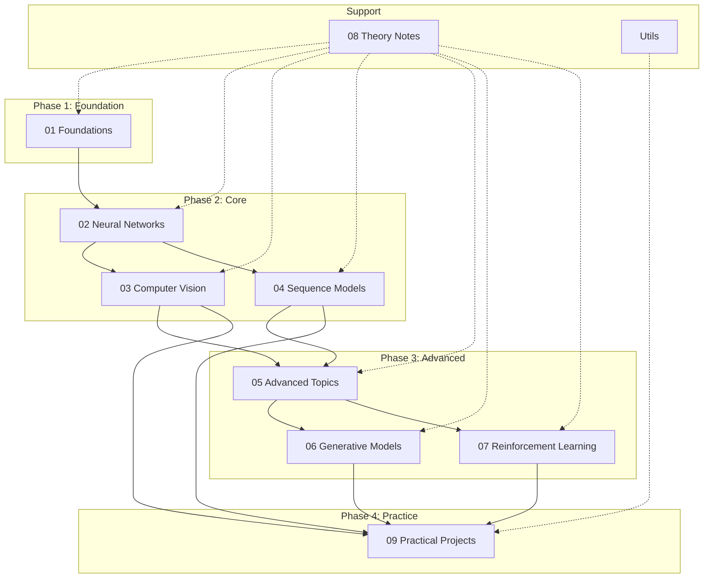

# Architecture

本页面详细介绍 AI-Practices 项目的系统架构设计、模块组织和技术决策。

---

## Table of Contents

- [Design Philosophy](#design-philosophy)
- [System Overview](#system-overview)
- [Module Architecture](#module-architecture)
- [Data Flow](#data-flow)
- [Technology Decisions](#technology-decisions)

---

## Design Philosophy

### Core Principles

AI-Practices 项目遵循以下核心设计原则：

| Principle | Description | Implementation |
|:----------|:------------|:---------------|
| **Modularity** | 模块化设计，低耦合高内聚 | 9 个独立学习模块 |
| **Progressive** | 渐进式学习，由浅入深 | PLF 四阶段方法论 |
| **Reproducibility** | 可复现性，完整记录 | Jupyter Notebooks + Seeds |
| **Production-Ready** | 工程化代码，遵循规范 | PEP8 + Type Hints |

### Progressive Learning Framework (PLF)

```
┌─────────────────────────────────────────────────────────────────────────────┐
│                      Progressive Learning Framework                          │
├─────────────────────────────────────────────────────────────────────────────┤
│                                                                              │
│    ┌──────────┐     ┌──────────┐     ┌──────────┐     ┌──────────┐         │
│    │  Phase   │     │  Phase   │     │  Phase   │     │  Phase   │         │
│    │    Ⅰ    │────▶│    Ⅱ    │────▶│    Ⅲ    │────▶│    Ⅳ    │         │
│    │  Theory  │     │  Impl    │     │Framework │     │ Practice │         │
│    └──────────┘     └──────────┘     └──────────┘     └──────────┘         │
│         │               │                │                │                 │
│         ▼               ▼                ▼                ▼                 │
│    ┌──────────┐    ┌──────────┐    ┌──────────┐    ┌──────────┐           │
│    │ 数学推导 │    │ NumPy    │    │TensorFlow│    │ Kaggle   │           │
│    │ 算法分析 │    │ 从零实现 │    │ PyTorch  │    │ Projects │           │
│    └──────────┘    └──────────┘    └──────────┘    └──────────┘           │
│                                                                              │
└─────────────────────────────────────────────────────────────────────────────┘
```

---

## System Overview

### High-Level Architecture

```
┌─────────────────────────────────────────────────────────────────────────────┐
│                            AI-Practices                                      │
├─────────────────────────────────────────────────────────────────────────────┤
│                                                                              │
│  ┌─────────────────────────────────────────────────────────────────────┐   │
│  │                        Learning Modules                              │   │
│  │  ┌─────────┐ ┌─────────┐ ┌─────────┐ ┌─────────┐ ┌─────────┐       │   │
│  │  │   01    │ │   02    │ │   03    │ │   04    │ │   05    │       │   │
│  │  │ Found-  │ │ Neural  │ │Computer │ │Sequence │ │Advanced │       │   │
│  │  │ ations  │ │Networks │ │ Vision  │ │ Models  │ │ Topics  │       │   │
│  │  └─────────┘ └─────────┘ └─────────┘ └─────────┘ └─────────┘       │   │
│  │  ┌─────────┐ ┌─────────┐ ┌─────────┐ ┌─────────┐                   │   │
│  │  │   06    │ │   07    │ │   08    │ │   09    │                   │   │
│  │  │Generati-│ │  RL     │ │ Theory  │ │Projects │                   │   │
│  │  │   ve    │ │         │ │ Notes   │ │         │                   │   │
│  │  └─────────┘ └─────────┘ └─────────┘ └─────────┘                   │   │
│  └─────────────────────────────────────────────────────────────────────┘   │
│                                    │                                         │
│                                    ▼                                         │
│  ┌─────────────────────────────────────────────────────────────────────┐   │
│  │                         Utils Layer                                  │   │
│  │  ┌───────────┐  ┌───────────┐  ┌───────────┐  ┌───────────┐        │   │
│  │  │  common   │  │   paths   │  │visualization│ │  metrics  │        │   │
│  │  └───────────┘  └───────────┘  └───────────┘  └───────────┘        │   │
│  └─────────────────────────────────────────────────────────────────────┘   │
│                                                                              │
└─────────────────────────────────────────────────────────────────────────────┘
```

### Module Dependencies



---

## Module Architecture

### Directory Structure

```
AI-Practices/
│
├── 01-foundations/                     # 机器学习基础
│   ├── 01-training-models/             # 模型训练
│   │   ├── 01_linear_regression.ipynb
│   │   ├── 02_gradient_descent.ipynb
│   │   ├── 03_polynomial_regression.ipynb
│   │   ├── 04_learning_curves.ipynb
│   │   └── 05_regularization.ipynb
│   ├── 02-classification/              # 分类算法
│   ├── 03-support-vector-machines/     # SVM
│   ├── 04-decision-trees/              # 决策树
│   ├── 05-ensemble-learning/           # 集成学习
│   ├── 06-dimensionality-reduction/    # 降维
│   ├── 07-unsupervised-learning/       # 无监督学习
│   └── 08-end-to-end-project/          # 端到端项目
│
├── 02-neural-networks/                 # 神经网络
│   ├── 01-keras-introduction/          # Keras 入门
│   ├── 02-training-deep-networks/      # 训练技巧
│   ├── 03-custom-models-training/      # 自定义模型
│   └── 04-data-loading-preprocessing/  # 数据管道
│
├── 03-computer-vision/                 # 计算机视觉
│   ├── 01-cnn-basics/                  # CNN 基础
│   ├── 02-classic-architectures/       # 经典架构
│   ├── 03-transfer-learning/           # 迁移学习
│   └── 04-visualization/               # 可视化
│
├── 04-sequence-models/                 # 序列模型
│   ├── 01-rnn-basics/                  # RNN 基础
│   ├── 02-lstm-gru/                    # LSTM/GRU
│   ├── 03-text-processing/             # 文本处理
│   └── 04-cnn-for-sequences/           # 序列 CNN
│
├── 05-advanced-topics/                 # 高级专题
│   ├── 01-functional-api/              # Functional API
│   ├── 02-callbacks-tensorboard/       # 回调与监控
│   └── 03-model-optimization/          # 模型优化
│
├── 06-generative-models/               # 生成式模型
│   ├── 01-autoencoders/                # 自编码器
│   ├── 02-gans/                        # GAN
│   ├── 03-variational-autoencoders/    # VAE
│   ├── 04-text-generation/             # 文本生成
│   └── 05-deepdream/                   # DeepDream
│
├── 07-reinforcement-learning/          # 强化学习
│   ├── 01-mdp-basics/                  # MDP 基础
│   ├── 02-q-learning/                  # Q-Learning
│   ├── 03-deep-rl/                     # 深度 RL
│   └── 04-policy-gradient/             # 策略梯度
│
├── 08-theory-notes/                    # 理论笔记
│   ├── activation-functions/           # 激活函数
│   ├── loss-functions/                 # 损失函数
│   └── architectures/                  # 架构设计
│
├── 09-practical-projects/              # 实战项目
│   ├── 01-ml-basics/                   # ML 项目
│   ├── 02-computer-vision/             # CV 项目
│   ├── 03-nlp/                         # NLP 项目
│   ├── 04-time-series/                 # 时序项目
│   └── 05-kaggle-competitions/         # Kaggle 竞赛
│
└── utils/                              # 工具库
    ├── __init__.py
    ├── common.py                       # 通用函数
    ├── paths.py                        # 路径管理
    ├── visualization.py                # 可视化
    └── metrics/                        # 评估指标
        ├── __init__.py
        ├── classification.py
        ├── regression.py
        └── ranking.py
```

### Notebook Structure Standard

每个 Jupyter Notebook 遵循统一的结构规范：

```python
"""
# [Module Name] - [Topic Name]

## Learning Objectives
- Objective 1
- Objective 2
- Objective 3

## Prerequisites
- Required knowledge
- Required packages

## Table of Contents
1. Introduction
2. Theory
3. Implementation
4. Experiments
5. Conclusion
6. References
"""

# %% [markdown]
# ## 1. Introduction

# %% [markdown]
# ## 2. Theory
# Mathematical foundations and algorithm explanation

# %% [code]
# Setup and imports
import numpy as np
import pandas as pd
import matplotlib.pyplot as plt

# Set random seed for reproducibility
RANDOM_SEED = 42
np.random.seed(RANDOM_SEED)

# %% [markdown]
# ## 3. Implementation

# %% [code]
# Implementation code with detailed comments

# %% [markdown]
# ## 4. Experiments

# %% [code]
# Experimental results and visualizations

# %% [markdown]
# ## 5. Conclusion

# %% [markdown]
# ## 6. References
# - [1] Paper/Book reference
# - [2] Online resource
```

### Project Structure Standard (09-practical-projects)

```
project-name/
├── README.md               # 项目说明
├── requirements.txt        # 项目依赖
├── config/                 # 配置文件
│   ├── config.yaml
│   └── logging.yaml
├── data/                   # 数据目录
│   ├── raw/                # 原始数据
│   ├── processed/          # 处理后数据
│   └── external/           # 外部数据
├── notebooks/              # 实验 Notebooks
│   ├── 01_eda.ipynb
│   ├── 02_feature_engineering.ipynb
│   └── 03_modeling.ipynb
├── src/                    # 源代码
│   ├── __init__.py
│   ├── data.py             # 数据处理
│   ├── features.py         # 特征工程
│   ├── model.py            # 模型定义
│   ├── train.py            # 训练脚本
│   └── evaluate.py         # 评估脚本
├── models/                 # 模型权重
├── reports/                # 报告文档
│   └── figures/            # 图表
└── tests/                  # 测试代码
    └── test_model.py
```

---

## Data Flow

### Training Pipeline

```
┌─────────────────────────────────────────────────────────────────────────────┐
│                           Training Pipeline                                  │
├─────────────────────────────────────────────────────────────────────────────┤
│                                                                              │
│  ┌─────────┐    ┌─────────┐    ┌─────────┐    ┌─────────┐    ┌─────────┐  │
│  │  Data   │───▶│ Feature │───▶│  Model  │───▶│Training │───▶│  Model  │  │
│  │ Loading │    │Engineer │    │  Build  │    │  Loop   │    │  Save   │  │
│  └─────────┘    └─────────┘    └─────────┘    └─────────┘    └─────────┘  │
│       │              │              │              │              │         │
│       ▼              ▼              ▼              ▼              ▼         │
│  ┌─────────┐    ┌─────────┐    ┌─────────┐    ┌─────────┐    ┌─────────┐  │
│  │Raw Data │    │Features │    │  Model  │    │Callbacks│    │Checkpoint│  │
│  │  Files  │    │  +Data  │    │  Config │    │ Logging │    │  +Logs  │  │
│  │         │    │  Split  │    │         │    │         │    │         │  │
│  └─────────┘    └─────────┘    └─────────┘    └─────────┘    └─────────┘  │
│                                                                              │
└─────────────────────────────────────────────────────────────────────────────┘
```

### Inference Pipeline

```
┌─────────────────────────────────────────────────────────────────────────────┐
│                          Inference Pipeline                                  │
├─────────────────────────────────────────────────────────────────────────────┤
│                                                                              │
│  ┌─────────┐    ┌─────────┐    ┌─────────┐    ┌─────────┐    ┌─────────┐  │
│  │  Input  │───▶│  Pre-   │───▶│  Model  │───▶│  Post-  │───▶│ Output  │  │
│  │  Data   │    │ process │    │Inference│    │ process │    │ Results │  │
│  └─────────┘    └─────────┘    └─────────┘    └─────────┘    └─────────┘  │
│                                                                              │
└─────────────────────────────────────────────────────────────────────────────┘
```

---

## Technology Decisions

### Framework Selection

| Use Case | Primary | Alternative | Rationale |
|:---------|:--------|:------------|:----------|
| **Prototyping** | TensorFlow/Keras | PyTorch | 简洁 API，快速迭代 |
| **Research** | PyTorch | JAX | 灵活性，动态图 |
| **Production** | TensorFlow | ONNX | 部署生态，TFLite/TF Serving |
| **NLP** | Transformers | spaCy | 预训练模型丰富 |
| **Tabular** | XGBoost/LightGBM | CatBoost | 性能优异，工业验证 |

### Code Standards

| Standard | Tool | Configuration |
|:---------|:-----|:--------------|
| **Style** | Black | `line-length = 88` |
| **Linting** | Ruff | PEP8 + additional rules |
| **Type Hints** | mypy | `strict = true` |
| **Docstrings** | Google Style | NumPy/Google format |
| **Testing** | pytest | `--cov=src --cov-report=html` |

### Version Control

| Artifact | Storage | Strategy |
|:---------|:--------|:---------|
| **Code** | Git/GitHub | Feature branches |
| **Data** | DVC / Git LFS | Version tracking |
| **Models** | MLflow / W&B | Experiment tracking |
| **Configs** | YAML | Version controlled |

---

## Next Steps

- [[Module 01: Foundations]] - 开始学习机器学习基础
- [[Best Practices]] - 编码最佳实践
- [[API Reference]] - API 参考文档

---

<div align="center">

**[[← Installation|Installation]]** | **[[Methodology →|Methodology]]**

</div>
